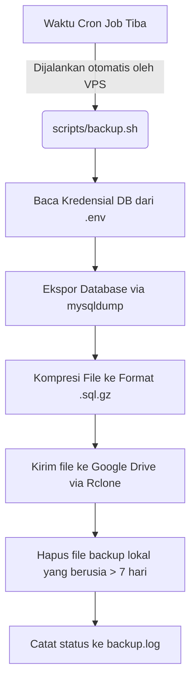

# Panduan Sistem Backup & Migrasi Raabiha E-Commerce

Dokumen ini menjelaskan rancangan, alur kerja (*flow*), dan panduan operasional untuk melakukan backup database otomatis ke Google Drive serta proses migrasi (restore) data secara mudah.

---

## 1. Jawaban Objektif untuk Kebutuhan Anda

> **Pertanyaan:** Apakah dengan **Cron Job + Shell Script** yang kita buat, keinginan Anda bisa direalisasikan?
>
> **Jawaban:** **Ya, 100% bisa direalisasikan dengan sangat mudah.**
>
> Berikut adalah penjelasan bagaimana keinginan Anda terpenuhi secara praktis:
>
> 1. **"Otomatis masuk ke Google Drive saya"**
>    * **Realisasi:** Menggunakan utility **Rclone** yang terpasang di VPS. Setiap kali script backup berjalan, file hasil backup langsung diunggah secara aman ke folder Google Drive Anda di latar belakang (*background*).
> 2. **"Bisa atur waktu backup (jam, hari, seberapa sering)"**
>    * **Realisasi:** Menggunakan antarmuka **CloudPanel** (Control Panel VPS Anda). CloudPanel menyediakan menu GUI "Cron Jobs" di mana Anda dapat memasukkan/mengubah jadwal backup (misalnya: harian, mingguan, atau setiap beberapa hari sekali) tanpa perlu membuka terminal SSH.
> 3. **"Mudah diunduh dan diunggah untuk migrasi"**
>    * **Realisasi:** 
>      * **Unduh:** Karena backup otomatis masuk ke Google Drive, Anda bisa mengunduh file backup `.sql.gz` tersebut kapan saja langsung dari aplikasi Google Drive di HP atau laptop Anda.
>      * **Unggah & Migrasi:** Jika ingin berpindah server, Anda tinggal mengunggah file tersebut ke server baru (via SFTP / File Manager CloudPanel) dan menjalankan perintah restore satu baris yang sangat ringan.

---

## 2. Alur Kerja Sistem (Flowchart)



---

## 3. Rincian Teknis & Output

### A. Lokasi Output File
1. **Lokal VPS:** Di dalam folder proyek: `storage/backups/` (di-ignore dari Git agar aman).
2. **Google Drive:** Di root drive atau di dalam folder khusus (misal: `RaabihaBackups/`).

### B. Format Nama File
Nama file menggunakan penamaan timestamp yang unik untuk mencegah tumpang tindih:
`db_[nama_database]_[tanggal]_[waktu].sql.gz`
*Contoh:* `db_db_raabiha_20260611_084700.sql.gz`

---

## 4. Panduan Mengatur Jadwal Backup (CloudPanel GUI)

Anda dapat mengatur waktu backup dengan mudah melalui dashboard CloudPanel:

1. Masuk ke **CloudPanel** VPS Anda.
2. Pilih situs web **Raabiha** Anda.
3. Klik menu **Cron Jobs** di bilah menu samping.
4. Klik **Add Cron Job**.
5. Masukkan konfigurasi berikut:
   * **Label:** `Backup Database Raabiha`
   * **Schedule (Jadwal):** Pilih salah satu template atau masukkan custom cron:
     * *Setiap hari jam 2 pagi:* `0 2 * * *`
     * *Setiap 3 hari sekali:* `0 2 */3 * *`
     * *Setiap hari Minggu tengah malam:* `0 0 * * 0`
   * **Command:**
     ```bash
     /bin/bash /home/kangjessy/Documents/projects/raabiha-ecommerce/scripts/backup.sh > /dev/null 2>&1
     ```
6. Klik **Save**.

---

## 5. Panduan Migrasi / Pemulihan Data (Disaster Recovery)

Jika server down atau Anda ingin melakukan migrasi database ke server baru, ikuti 3 langkah mudah berikut:

### Langkah 1: Unduh Backup
Buka Google Drive Anda, lalu unduh file backup terbaru (misal: `db_db_raabiha_20260611_084700.sql.gz`) ke komputer Anda.

### Langkah 2: Unggah ke Server Baru
Unggah file `.sql.gz` tersebut ke folder server baru menggunakan **SFTP** (seperti FileZilla) atau **File Manager** CloudPanel. Letakkan di folder bebas (misalnya di root folder aplikasi Laravel Anda).

### Langkah 3: Eksekusi Restore
Buka terminal SSH server baru, navigasikan ke folder tempat Anda mengunggah file tersebut, dan jalankan perintah satu baris berikut:

```bash
# Ganti parameter kurung siku dengan kredensial database server baru Anda
gunzip < db_db_raabiha_20260611_084700.sql.gz | mysql -h 127.0.0.1 -u [db_username] -p[db_password] [db_database]
```

Selesai! Seluruh data transaksi, produk, komentar, dan pengaturan toko Anda telah sepenuhnya pulih di server yang baru.
