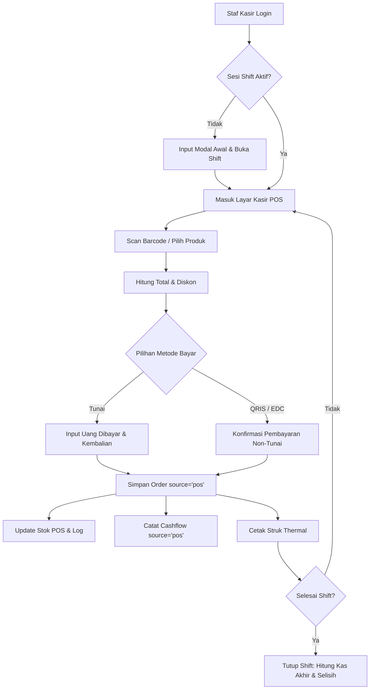

# Perancangan & Spesifikasi Sistem POS (Point of Sale) Raabiha

Dokumen ini berisi analisa kebutuhan, arsitektur data, dan strategi integrasi modul POS (Point of Sale) ke dalam sistem e-commerce Raabiha yang sudah berjalan.

---

## 1. Arsitektur Produk & Isolasi Stok (Ecommerce vs POS)

### A. Channel Visibility Produk

Untuk mengakomodasi kebutuhan bisnis di mana **produk toko fisik dan e-commerce berbeda**, digunakan logika _Channel Visibility_:

- **Pilihan Channel pada Produk (`channel_visibility`):**
    1. `online_only`: Hanya dijual di e-commerce web.
    2. `pos_only`: Hanya dijual di Toko Fisik (Kasir POS).
    3. `both`: Tersedia di kedua saluran (Antisipasi kebutuhan masa depan).

- **Logika Filter Sistem:**
    - **Storefront E-Commerce (Web):**
      Query produk wajib memfilter: `WHERE channel_visibility IN ('online_only', 'both')`
    - **Aplikasi Kasir POS (Livewire):**
      Query produk wajib memfilter: `WHERE channel_visibility IN ('pos_only', 'both')`

### B. Manajemen & Transfer Stok

1. **Produk Terisolasi (`pos_only` vs `online_only`):**
    - Karena produk terpisah, stok produk POS murni memotong stok barang tersebut saat transaksi POS terjadi. Tidak ada risiko bentrok atau _over-selling_ dengan pembeli online.
2. **Fungsi Transfer Stok (Admin Panel):**
    - Jika ada produk yang diubah statusnya menjadi `both`, atau jika admin ingin memindahkan alokasi unit dari gudang online ke toko fisik, Admin Panel menyediakan fitur **Transfer Stok**.
    - Setiap perpindahan dicatat secara transparan pada model `StockLog` dengan `type = 'channel_transfer'` beserta catatan alasannya.

---

## 2. Strategi Cetak Struk Thermal (Khusus PC/Laptop)

Pencetakan struk kasir menggunakan printer thermal (58mm / 80mm). Hanya 2 metode yang didukung — keduanya native Chrome Desktop, berbasis web standar, tanpa install app apapun.

> **Catatan Teknis Penting:** Web Bluetooth & Web Serial API *hanya* bekerja di environment aman (**HTTPS Wajib**) atau `localhost`. Ini adalah syarat mutlak keamanan dari browser Chrome.

### A. Web Bluetooth API *(Metode Utama — Tanpa Kabel)*

* **Platform:** Chrome Desktop (Laptop/PC) dengan koneksi Bluetooth.
* **Mekanisme:** Browser terhubung langsung ke printer Bluetooth tanpa `window.print()` dan tanpa dialog OS. Data cetak dikirim via **ESC/POS protocol over Bluetooth GATT**.
* **Keunggulan:** Bebas kabel; bisa memicu **Auto-Cutter** & **Cash Drawer** via ESC/POS command.
* **Setup:** Klik "Hubungkan Printer" di halaman Pengaturan POS → Chrome tampilkan device picker native → Pairing selesai, info tersimpan di `localStorage`. Sesi berikutnya cukup 1-tap "Sambungkan Ulang".

### B. Web Serial API *(Metode Sekunder — desktop USB)*

* **Platform:** Chrome Desktop (Laptop/PC) dengan printer terhubung via kabel USB.
* **Mekanisme:** Browser akses serial port USB langsung via Web Serial API — tanpa install driver tambahan.
* **Keunggulan:** Koneksi kabel lebih stabil dari Bluetooth di lingkungan ramai (interference tinggi).
* **Setup:** Klik "Hubungkan Printer" → Chrome tampilkan dialog pilih port USB → Selesai.

> **Catatan:** Chrome Kiosk `--kiosk-printing` (flag command-line device, bukan setting web) dan RawBT (memerlukan install app) **tidak digunakan** — tidak sesuai dengan constraint "konfigurasi dari dalam web" dan "tanpa install app".

### C. Pengaturan Struk & Perangkat Printer (POS Receipt Settings)

Agar tampilan struk dan koneksi printer bisa disesuaikan, disediakan halaman **Pengaturan POS** di Admin Panel & Aplikasi Kasir:

1. **Pengaturan Tampilan & Desain Struk (Branding Struk):**
    * **Logo Toko:** Option tampilkan/sembunyikan logo monochrome di bagian atas struk.
    * **Header Struk:** Nama Toko Fisik, Alamat Lengkap, Nomor Telepon/WhatsApp, dan Link IG/Website.
    * **Footer Struk:** Pesan penutup, Kebijakan Retur, atau Promo QR Code.
    * **Metadata Struk:** Toggle tampilkan Nama Kasir, Tanggal & Jam, ID Sesi Shift, dan Metode Pembayaran.

2. **Pengaturan Perangkat & Spesifikasi Thermal:**
    * **Ukuran Kertas Thermal:** Pilihan `58mm` (Bluetooth portabel) atau `80mm` (desktop USB).
    * **Mode Koneksi Printer:** `Web Bluetooth` atau `Web Serial USB` — pilih sesuai jenis printer fisik yang tersedia.
    * **Perintah Hardware (ESC/POS Control):**
        * `Open Cash Drawer`: Otomatis kirim sinyal pemantik laci uang kasir saat cetak struk selesai.
        * `Auto Cut Paper`: Otomatis potong kertas untuk printer yang memiliki fitur _auto-cutter_.
    * **Jumlah Cetak (Copies):** 1 lembar (pelanggan) atau 2 lembar (pelanggan + arsip toko).
    * **Simpan Koneksi Perangkat:** Info pairing printer (MAC Address / Port Name) disimpan di `localStorage` browser kasir.

---

## 3. Desain Struktur Database & Relasi

### A. Penyesuaian Tabel `orders` (Reuse untuk POS)

Tabel `orders` eksisting diperluas agar bisa menampung transaksi POS.

> **⚠️ Perhatian Urutan Migrasi:** Tabel `pos_sessions` **harus dibuat lebih dulu** sebelum `ALTER TABLE orders` yang menambahkan FK ke `pos_sessions`. Jika dibalik, FK constraint akan gagal karena tabel referensi belum ada.

> **⚠️ Kolom `source`:** Kolom ini **sudah ada** di tabel `orders` eksisting (migration `2026_06_07_154740_add_source_and_voucher_to_orders_table.php`) dengan default `'ecommerce'`. Nilai default cukup diubah menjadi `'online'` atau dibiarkan, dan POS akan menggunakan `'pos'`. **Jangan tambahkan kolom `source` lagi di migrasi POS.**

### B. Tabel Baru: `pos_sessions` (Manajemen Shift Kasir) — *Dibuat Duluan*

Menangani sesi buka/tutup kasir dan akuntabilitas modal kas:

```sql
CREATE TABLE pos_sessions (
    id BIGINT UNSIGNED AUTO_INCREMENT PRIMARY KEY,
    cashier_id BIGINT UNSIGNED NOT NULL,
    opened_at DATETIME NOT NULL,
    closed_at DATETIME NULL,
    opening_cash DECIMAL(12,2) NOT NULL DEFAULT 0.00,
    expected_ending_cash DECIMAL(12,2) NULL,
    actual_ending_cash DECIMAL(12,2) NULL,
    difference_cash DECIMAL(12,2) NULL,
    status ENUM('open', 'closed') DEFAULT 'open',
    -- Virtual column untuk unique constraint "satu shift open per kasir"
    -- Teknik MySQL/MariaDB: NULL diabaikan di UNIQUE INDEX, non-NULL di-enforce
    open_session_marker BIGINT UNSIGNED GENERATED ALWAYS AS
        (IF(status = 'open', cashier_id, NULL)) VIRTUAL,
    notes TEXT NULL,
    created_at TIMESTAMP DEFAULT CURRENT_TIMESTAMP,
    updated_at TIMESTAMP DEFAULT CURRENT_TIMESTAMP ON UPDATE CURRENT_TIMESTAMP,
    FOREIGN KEY (cashier_id) REFERENCES users(id)
);

-- Index unique pada virtual column: efektif mencegah 2 sesi 'open' per kasir
-- (MySQL/MariaDB tidak support partial index WHERE, ini workaround yang equivalen)
CREATE UNIQUE INDEX idx_one_open_shift_per_cashier
    ON pos_sessions (open_session_marker);
```

> **Catatan teknis:** `WHERE status = 'open'` di `CREATE UNIQUE INDEX` adalah partial index — hanya didukung PostgreSQL/SQL Server, **tidak didukung MySQL/MariaDB**. Solusi di atas menggunakan virtual/generated column yang nilainya `NULL` saat shift `closed` (NULL tidak di-enforce di UNIQUE INDEX MySQL), dan berisi `cashier_id` hanya saat shift `open` — efek akhirnya identik.

### A. Perluasan Tabel `orders` — *Setelah `pos_sessions` Dibuat*

Setelah `pos_sessions` ada, tabel `orders` diperluas dengan kolom-kolom baru:

```sql
-- PENTING: Jalankan SETELAH migration pos_sessions selesai
ALTER TABLE orders
ADD COLUMN pos_session_id BIGINT UNSIGNED NULL AFTER source,
ADD COLUMN cashier_id    BIGINT UNSIGNED NULL AFTER user_id,
ADD COLUMN customer_name  VARCHAR(255)    NULL AFTER cashier_id,
ADD COLUMN customer_phone VARCHAR(20)     NULL AFTER customer_name,
ADD COLUMN cash_paid      DECIMAL(12,2)   NULL AFTER grand_total,
ADD COLUMN cash_change    DECIMAL(12,2)   NULL AFTER cash_paid,
ADD COLUMN payment_details JSON           NULL AFTER cash_change,
ADD CONSTRAINT fk_orders_pos_session FOREIGN KEY (pos_session_id) REFERENCES pos_sessions(id),
ADD CONSTRAINT fk_orders_cashier     FOREIGN KEY (cashier_id) REFERENCES users(id);
```

**Kolom yang sudah ada di `orders` (jangan ditambahkan lagi):**
* `source` — sudah ada, default `'ecommerce'`. Nilai `'pos'` akan diisi saat transaksi POS.
* `user_id` — sudah nullable (migration `2026_06_04_041353`). Pelanggan *walk-in* tidak wajib punya akun.
* `voucher_id` — sudah ada.

**Index Tambahan yang Wajib Dibuat di Migrasi:**
Untuk performa query yang optimal, index berikut harus disertakan dalam migration file:
* `orders(pos_session_id)` — untuk join ke tabel sesi shift.
* `orders(source)` — untuk filter laporan e-commerce vs POS.
* `orders(cashier_id)` — untuk laporan penjualan per kasir.
* `pos_sessions(cashier_id, status)` — untuk validasi shift aktif.
* `products(channel_visibility)` — untuk filter katalog POS saat load.

> **ℹ️ Catatan Kompatibilitas E-Commerce vs Toko Fisik:**
> Transaksi POS (Toko Fisik) **tidak membutuhkan pengiriman**. Hal ini sudah aman secara struktur database eksisting karena:
> - Kolom `shipping_address`, `courier`, dan `awb_number` sifatnya `nullable`.
> - Kolom `shipping_cost` memiliki default `0`.
> - Untuk metode pembayaran, e-commerce menggunakan payment gateway (`payment_id`, `payment_url`), sedangkan POS menggunakan pembayaran manual/tunai/EDC yang dicatat pada kolom baru (`cash_paid`, `payment_details`). Keduanya menggunakan set kolom yang berbeda sehingga **tidak akan bentrok**.

### C. Integrasi Arus Kas (`cashflows`)

- Setiap transaksi POS yang selesai (`completed`) otomatis menginsert entri ke `cashflows`:
    - `source`: `'pos'`
    - `category`: `'pos_sale'`
    - `type`: `'in'` *(konsisten dengan nilai yang sudah ada di cashflows eksisting)*
    - `amount`: Nilai transaksi (`grand_total`)
- Kas awal shift & penyesuaian selisih kasir dicatat sebagai entri terpisah (`category = 'pos_opening_balance'` / `'pos_reconciliation'`).
- **Pola Reversal (Void/Batal POS) — Diverifikasi dari Kode Eksisting:**
  Entry asli **tidak diubah** (immutable). Void membuat **entri baru** dengan `type = 'out'`, **`amount` positif** (nilai transaksi yang dibatalkan), dan `category = 'pos_void'`.

  > **Kenapa `amount` harus positif (bukan negatif)?** Dari verifikasi kode di `DashboardStatsOverview.php` (baris 65–79) dan `CashflowStatsWidget.php` (baris 26–27), semua query existing menggunakan pola:
  > ```sql
  > SUM(CASE WHEN type = 'in' THEN amount ELSE 0 END) as total_in
  > SUM(CASE WHEN type = 'out' THEN amount ELSE 0 END) as total_out
  > ```
  > Laba bersih dihitung sebagai `total_in - total_out` (bukan `SUM` signed). Artinya **`amount` selalu positif — arah arus kas ditentukan oleh `type`**. Jika void menggunakan `type='out'` + `amount` negatif, query existing akan menghitung `SUM(CASE WHEN type='out' THEN -X ELSE 0) = -X` → saat dikurangkan jadi `total_in - (-X) = total_in + X` → void malah **menambah** keuntungan. Ini double-negative yang merusak laporan.

---

## 4. Logika Transaksi & Workflow POS

**PosTransactionService (Isolasi Logika):** 
Seluruh alur transaksi di bawah ini dikendalikan oleh **`PosTransactionService`**. Service ini membungkus pembuatan order, pengurangan stok (dengan `lockForUpdate`), dan pencatatan cashflow dalam satu **`DB::transaction()`** (Atomicity). Hal ini menjamin tidak ada data yang terpotong setengah jalan jika terjadi error. Pencetakan struk dilakukan di luar transaksi agar kegagalan printer tidak membatalkan penjualan yang sah.



---

## 5. Rancangan UI/UX Aplikasi Kasir (Livewire Component)

Layar POS dirancang dengan pendekatan **Fast-Checkout Responsive Interface**:

1. **Header Kasir:**
    - Informasi Shift Aktif (Nama Kasir, Jam Buka, Modal Awal).
    - Status Koneksi & Printer Thermal.
    - Tombol "Tutup Shift".

2. **Panel Kiri (Katalog Produk POS):**
    - Input pencarian cepat (_Autofocus_ untuk Barcode Scanner USB/Bluetooth).
    - Tab Kategori Produk.
    - Grid Card Produk (Gambar, Nama, Harga, sisa `stock_pos`).

3. **Panel Kanan (Keranjang & Pembayaran):**
    - Daftar Item Keranjang (Qty, Harga, Diskon per item, Hapus item).
    - Rincian Subtotal, Diskon Nota, & Grand Total.
    - Tombol Pembayaran Cepat Tunai (Uang Pas, Rp 50.000, Rp 100.000, Custom Amount).
    - Modal Checkout (Metode Bayar, Kembalian, Tombol "Bayar & Cetak Struk").

### A. Arsitektur Komponen (Hybrid Alpine.js + Livewire)

Untuk menjamin kecepatan tanpa *lag* server, POS tidak menggunakan Livewire murni, melainkan arsitektur **Hybrid**:

| Layer | Teknologi | Tanggung Jawab | Trust Boundary |
|---|---|---|---|
| **State Keranjang** | **Alpine.js** | Tambah item, kurang qty, subtotal, kembalian (kalkulasi instan di browser). | Angka ini **tidak dipercaya server** (bisa dimanipulasi DevTools). |
| **Pencarian Produk** | **Alpine.js + Cache** | Filter & tampilkan produk seketika saat kasir mengetik (Offline/Cache-first). | Hanya untuk UI. |
| **Tambah Item (Scan)** | **Livewire** | Cek ketersediaan stok fisik ke database secara real-time. | Server yang berwenang menolak jika stok habis. |
| **Submit Checkout** | **Livewire** | Terima payload `[variant_id, qty]`. **Recompute ulang harga dan total dari DB**. | Server adalah *Source of Truth*. Harga dari client diabaikan. |

### B. Keamanan & Idempotency Transaksi

1. **Idempotency Key (Mencegah Double-Order):** Saat modal checkout terbuka, Alpine.js men-generate UUID murni. UUID ini dikirim ke server saat klik "Bayar". Jika koneksi lag dan kasir klik 2 kali, server mengenali UUID yang sama dan tidak memproses order ganda.
2. **Server-Side Validation:** Batas diskon manual maksimal dan persetujuan PIN Supervisor wajib divalidasi ketat di sisi server (PHP), bukan hanya disembunyikan di UI.

## 7. Hasil Audit Sistem, Analisa Celah & Mitigasi Risiko

Setelah dilakukan audit komprehensif terhadap codebase eksisting (`Order`, `Product`, `Cashflow`, `StockLog`, `Voucher`), ditemukan **7 celah potensial** yang harus diantisipasi sebelum tahap pengembangan:

---

### 🚨 Celah 1: Pelanggan Walk-In vs User Registered

- **Celah:** Pada e-commerce online, kolom `user_id` di `orders` terhubung ke pembeli teregistrasi. Di toko fisik, 90% pembeli adalah pelanggan umum (_Walk-in Customer_) yang tidak punya akun.
- **Risiko:** Query/validation e-commerce bisa _crash_ jika `user_id` bernilai `null` atau dipaksa menggunakan ID dummy (`user_id = 1`).
- **Solusi & Mitigasi:**
    1. Ubah kolom `user_id` pada tabel `orders` menjadi **`nullable()`**.
    2. Tambahkan kolom `customer_name` dan `customer_phone` (opsional) di `orders` untuk mencatat pembeli fisik.
    3. Di UI Kasir, sediakan fitur **"Cari/Daftar Member"** via No. HP agar pelanggan toko fisik tetap bisa mengumpulkan Poin Member / Riwayat Belanja di e-commerce.

---

### 🚨 Celah 2: Alamat Pengiriman & Ongkir di Transaksi POS

- **Celah:** Transaksi e-commerce wajib mengisi `shipping_address`, `courier`, dan `shipping_cost`. Transaksi POS fisik tidak membutuhkan pengiriman.
- **Risiko:** Observer / Service `Order` online memicu error karena alamat atau kurir kosong.
- **Solusi & Mitigasi:**
    1. Semua logika validation, pemicu webhook rajaongkir, dan pembuatan resi wajib di-wrap dengan pengecekan: `if ($order->source === 'online')`.
    2. Untuk `source = 'pos'`, defaultkan `shipping_cost = 0`, `courier = 'WALK_IN'`, dan `shipping_address = NULL`.

---

### 🚨 Celah 3: Penanganan Koneksi Internet Mati (Optional / Future Scope)

- **Catatan Scope:** Fitur full-offline mode ini disepakati **opsional / di luar scope utama MVP** agar pengerjaan awal tetap fokus, efisien, dan cepat.
- **Pendekatan Utama (Online-First):** POS beroperasi secara _online real-time_ terhubung ke server Laravel. Jika di masa depan toko membutuhkan daya tahan internet mati, arsitektur _Local Cache Queue_ bisa ditambahkan sebagai opsi lanjutan.

---

### 🚨 Celah 4: Wajib SKU & Hirarki Scan Barcode (Parent vs Variant SKU)

- **Celah:** Produk di sistem Raabiha terbagi 2 jenis: **Produk Tunggal (Single Product)** dan **Produk Varian (Has Variants)**.
- **Risiko:** Scanner kasir membaca pola SKU/Barcode fisik. Jika varian tidak memiliki SKU sendiri, kasir kesulitan membedakan varian mana (ukuran/warna) yang diambil pelanggan.
- **Solusi & Algoritma Pencarian Smart SKU:**
    1. **Aturan Input SKU:** Wajibkan pengisian SKU saat produk atau variannya di-toggle ke POS.
    2. **Hirarki SKU Parent vs Varian:**
        - **Produk Single (`has_variants = false`):** SKU berada di tabel `products.sku` (contoh: `H`).
        - **Produk Varian (`has_variants = true`):** SKU berada di tabel `product_variants.sku` (contoh: `H-BSI-3`). Admin bisa memanfaatkan fitur _Auto-Generate Variant SKU_ berdasarkan pola: `[SKU Parent]-[Kode Varian]`.
    3. **Algoritma Scan Barcode POS Kasir:**
        - Langkah 1: Cari tepat (_exact match_) di `product_variants.sku`.
        - Langkah 2: Jika tidak ketemu, cari di `products.sku` di mana `has_variants = false`.

---

### 🚨 Celah 5: Otorisasi Role & Keamanan Kasir (Supervisor Approval)

- **Celah:** Staf kasir tidak boleh memiliki akses ke Laporan Laba Rugi Keseluruhan Toko, Halaman Edit Harga Pokok Pembelian (HPP), atau Setting Website E-Commerce.
- **Risiko:** Kebocoran data sensitif bisnis atau penyalahgunaan wewenang (misal kasir sembarangan meng-cut harga).
- **Solusi & Mitigasi:**
    1. Terapkan Role `Staf Kasir` khusus. Begitu login, kasir langsung di-redirect ke Layar POS `/admin/pos` tanpa menu sidebar admin lainnya.
    2. Transaksi sensitif seperti **Void Transaksi** atau **Diskon Manual di Luar Promo** wajib memerlukan **PIN Supervisor / Admin Approval** popup di layar kasir.

---

### 🚨 Celah 6: Multi-Harga & Diskon Manual Kasir

- **Celah:** Harga toko fisik terkadang berbeda dari harga e-commerce (misal karena biaya operasional ruko), atau kasir perlu memberi diskon nego/pembulatan tunai.
- **Solusi & Mitigasi:**
    1. Tambahkan kolom opsional `pos_price` dan `pos_discount_price` pada `products` / `product_variants`. Jika kosong, sistem otomatis memakai `price` standar.
    2. Sediakan fitur **Diskon Manual (Nominal / Persen)** di layar kasir POS dengan batasan maksimum diskon (misal max 10% tanpa PIN Supervisor).

---

### 🚨 Celah 7: Segmentasi Voucher Promo (Kolom `usable_channel`)

- **Celah:** Model `Voucher` e-commerce saat ini digunakan untuk diskon belanja web & gratis ongkir.
- **Risiko:** Pelanggan mencoba klaim kode voucher "Gratis Ongkir Online" di kasir fisik toko, atau voucher khusus toko fisik dipakai online.
- **Solusi & Segmentasi Kolom:**
    1. Tambahkan kolom khusus **`usable_channel`** (`online_only`, `pos_only`, `both`) pada tabel `vouchers`.
    2. **Toko Online Web:** Hanya mengizinkan klaim voucher meggunakan `usable_channel IN ('online_only', 'both')`.
    3. **Aplikasi Kasir POS:** Hanya mengizinkan klaim voucher meggunakan `usable_channel IN ('pos_only', 'both')`.

---

### 🚨 Celah 8: Integrasi Metode Pembayaran Offline & Split Payment

- **Temuan Kode Eksisting:** Di model `PaymentMethod` dan form admin (`PaymentMethodForm.php`), **sudah tersedia** konfigurasi `availability` dengan pilihan: `'both'` (Online & Offline), `'online'`, dan `'offline'`.
- **Pemanfaatan:**
    1. Kita tidak perlu buat tabel metode pembayaran baru! Cukup buat metode seperti `Cash (Tunai POS)`, `EDC Bank`, atau `QRIS Statis Toko` di `PaymentMethod` dengan `availability = 'offline'` atau `'both'`.
    2. **Split Payment (Pembayaran Campuran):** Untuk mencatat pecahan bayar (misal 50rb Cash + 100rb EDC), kita tinggal menyimpan pecahan array metode pembayaran tersebut di kolom JSON `payment_details` pada tabel `orders`.

---

### 🚨 Celah 9: Transaksi Gantung / Hold Basket (Pending Cart)

- **Celah:** Saat antrian kasir, Pembeli A sudah meletakkan barang di meja kasir tetapi tiba-tiba kembali ke rak untuk mengambil barang tambahan. Pembeli B di belakangnya siap membayar.
- **Risiko:** Kasir harus membatalkan/menghapus keranjang Pembeli A satu per satu untuk melayani Pembeli B, lalu mengulang scan barang Pembeli A dari awal.
- **Solusi & Mitigasi:**
    1. Buat fitur **"Simpan Keranjang / Hold Basket"** di UI Kasir POS.
    2. Kasir dapat mengklik "Hold", melayani Pembeli B hingga selesai, kemudian menekan **"Recall Basket"** untuk melanjutkan keranjang Pembeli A tanpa scan ulang.

---

### 🚨 Celah 10: Retur Fisik: Refund Uang vs Tukar Barang (Exchange)

- **Celah:** Di toko fisik, 80% kasus retur (misal baju kekecilan) bukan meminta uang kembali (_Refund Cash_), melainkan **Tukar Ukuran / Tukar Barang Lain** yang harganya sama atau lebih mahal.
- **Risiko:** Jika sistem POS hanya menyediakan fitur "Refund", pencatatan stok dan penyesuaian kas menjadi tidak akurat.
- **Solusi & Mitigasi:**
    1. Modul Retur POS menyediakan 2 mode:
        - **Mode Refund Uang:** Barang masuk stok POS (+qty), kas keluar di `Cashflow` (`is_reversed = true`).
        - **Mode Tukar Barang (Exchange):** Barang lama masuk stok POS (+qty), barang baru keluar dari stok POS (-qty). Jika barang baru lebih mahal, kasir menerima selisih uang bayar; jika lebih murah, sistem menghitung kembalian.

---

### 🚨 Celah 11: Skema Harga Reseller & Diskon Potongan di POS

- **Klarifikasi Klien:** Klien belum memiliki sistem kompleks khusus reseller, sehingga di POS tidak perlu dibuatkan logika reseller baru yang rumit.
- **Solusi Sederhana:**
    1. Layar kasir POS menyediakan opsi cepat untuk menerapkan **`reseller_price`** (yang sudah tersedia di model `Product`/`ProductVariant`).
    2. Atau kasir cukup menginput **Diskon Potongan Harga / Diskon Manual** langsung di keranjang tanpa perlu syarat logika bertingkat.

---

### 🚨 Celah 12: Cetak Struk Rangkuman Shift Kasir (Z-Report Thermal)

- **Celah:** Saat kasir melakukan "Tutup Shift", manajer/owner membutuhkan bukti fisik penghitungan uang kasir yang dimasukkan ke dalam amplop kasir.
- **Risiko:** Tidak ada bukti fisik tertulis saat penyerahan setoran uang kasir antar shift.
- **Solusi & Mitigasi:**
    1. Begitu kasir mengklik "Tutup Shift" dan menginput kas akhir, printer thermal otomatis mencetak **Struk Ringkasan Shift (Z-Report)**.
    2. Struk berisi: Nama Kasir, Jam Buka/Tutup, Modal Awal, Total Penjualan Tunai, Total QRIS/EDC, Total Void/Retur, Kas Akhir Teoretis vs Kas Aktual, dan Selisih. Struk dimasukkan ke amplop setoran uang.

---

### 🚨 Celah 13: Penyesuaian Stok Cepat / Barang Rusak di Toko (Quick Stock Adjustment)

- **Celah:** Di toko fisik, sering ditemukan barang cacat/rusak/hilang (_shrinkage_) saat jam operasional toko.
- **Risiko:** Kasir/staf toko harus login ke Admin Panel Filament yang rumit untuk memotong stok.
- **Solusi & Mitigasi:**
    1. Sediakan modal **"Stock Adjustment Cepat"** di POS (akses terbatas via PIN Supervisor).
    2. Staf tinggal scan produk, pilih alasan (`Damaged` / `Lost` / `Display Sample`), dan masukkan qty. Stok POS langsung terpotong dan otomatis tercatat di `StockLog`.

---

### 🚨 Celah 14: Pajak Resto / Daerah / PPN Toko Fisik (Opsional)

- **Celah:** Beberapa toko fisik menerapkan Pajak PPN / Daerah (misal 10% / 11%) khusus untuk pembelian fisik.
- **Solusi & Mitigasi:**
    1. Sediakan toggle **"Aktifkan Pajak POS"** di Pengaturan POS (Default: Nonaktif).
    2. Jika diaktifkan, nota belanja POS otomatis menambahkan baris `Tax Amount` sebelum Grand Total.

---

### 🚨 Celah 15: Penanganan Cetak Ulang Struk (Reprint Receipt)

- **Celah:** Pelanggan meminta cetak ulang nota karena struk pertama hilang/sobek, atau kasir mengalami printer macet (_paper jam_) saat transaksi selesai.
- **Risiko:** Jika kasir membuat ulang order untuk mencetak struk, stok produk akan terpotong dua kali (_double stock deduction_).
- **Solusi & Mitigasi:**
    1. Di UI Kasir, sediakan menu **"Riwayat Transaksi POS"**.
    2. Tambahkan tombol **"Cetak Ulang Struk" (Reprint)** pada tiap baris riwayat transaksi.
    3. Struk cetak ulang diberi teks penanda **`\*** SALINAN / REPRINT **\*`** di bagian header untuk mencegah penyalahgunaan klaim ganda.

---

### 🚨 Celah 16: Uang Kas Operasional Toko / Kas Masuk-Keluar (Petty Cash Shift)

- **Celah:** Di tengah shift, kasir sering memakai uang tunai laci kasir untuk pengeluaran kecil toko (misal: beli isi ulang air galon ruko Rp 25.000 atau beli lakban toko).
- **Risiko:** Uang laci kasir di akhir shift akan minus Rp 25.000. Jika tidak dicatat, sistem menganggap kasir mengalami selisih/rugi kas.
- **Solusi & Mitigasi:**
    1. Di Layar POS, sediakan fitur **"Kas Masuk / Kas Keluar (Petty Cash)"**.
    2. Kasir menginput: Tipe (`Kas Keluar`), Nominal (`Rp 25.000`), dan Keterangan (`Beli air galon ruko`).
    3. Ini otomatis memotong nilai `expected_ending_cash` saat Tutup Shift dan mencatat entri `Cashflow` (`category = 'pos_petty_cash'`).

---

### 🚨 Celah 17: Evaluasi Promo Otomatis di Keranjang POS (`promo_rules`)

- **Celah:** Model `Product` memiliki atribut JSON `promo_rules` (misal diskon kuantitas "Beli 2 Diskon 10%").
- **Risiko:** Kasir lupa menghitung diskon promo produk saat pelanggan membawa 2 barang ke meja kasir.
- **Solusi & Mitigasi:**
    1. Keranjang POS otomatis mengevaluasi atribut `promo_rules` setiap kali produk ditambahkan ke keranjang.
    2. Jika syarat promo terpenuhi, diskon otomatis terpotong pada subtotal item di layar kasir.

---

### 🚨 Celah 18: Penguncian Layar Kasir Sementara (POS Lock Screen)

- **Celah:** Staf kasir perlu meninggalkan meja kasir sementara (misal ke toilet atau mengambil barang di gudang belakang) saat toko fisik ramai.
- **Risiko:** Orang luar atau staf lain yang tidak berwenang bisa mengacak-acak layar kasir atau melakukan transaksi tanpa sepengetahuan kasir yang bertugas.
- **Solusi & Mitigasi:**
    1. Sediakan tombol **"Kunci Layar (Lock Screen)"** di UI POS, dan fitur _Auto-Lock_ jika layar tidak disentuh selama 5 menit.
    2. Untuk membuka kembali layar kasir, staf cukup memasukkan **PIN Kasir**, tanpa perlu mengakhiri sesi shift yang sedang berjalan.

---

### 🚨 Celah 19: Pencarian Pelanggan / Member (Tanpa Poin Loyalti)

- **Klarifikasi Scope:** Klien **tidak memiliki** program poin loyalti, sehingga tidak perlu membuat sistem perhitungan/penukaran poin belanja.
- **Pemanfaatan Pencarian Pelanggan:**
    1. Di header keranjang POS, sediakan kolom pencarian cepat **"Cari / Tambah Pelanggan"** (berdasarkan No. HP / Nama / Email).
    2. Ini murni berfungsi untuk mengaitkan transaksi POS fisik dengan profil `user_id` pelanggan (jika sudah punya akun) atau mencatat `customer_name` & `customer_phone` pada nota.
    3. **Manfaat:** Owner dapat melihat **Riwayat Belanja Konsolidasi** seorang pelanggan (apa saja yang dibeli via website dan apa saja yang dibeli di toko fisik), serta memudahkan pengiriman Nota Digital via WhatsApp jika dibutuhkan.

---

### 🚨 Celah 20: Laporan Analytics Konsolidasi vs Per-Channel Sales

- **Celah:** Admin/Owner membuka Dashboard Filament untuk melihat grafik omzet bulanan.
- **Risiko:** Grafik gabungan membuat Owner tidak bisa membedakan mana pendapatan murni dari Website E-Commerce dan mana dari Toko Fisik POS.
- **Solusi & Mitigasi:**
    1. Semua Widget Dashboard Sales & Financial Charts di Filament Admin dilengkapi dropdown Filter Saluran: **`Semua Saluran`**, **`Toko Online Web`**, dan **`Toko Fisik POS`**.
    2. Owner bisa menganalisis performa bisnis offline vs online secara independen maupun konsolidasi.

---

### 🚨 Celah 21: Integrasi Logika Retur dengan Manajemen Stok Eksisting

- **Temuan Kode Eksisting:** Di fitur Manajemen Stok admin (`StockManagementTable.php`), **sudah tersedia** pilihan alasan perubahan stok pada model `StockLog`:
    - `'Restock'` (Restock / Barang Masuk)
    - `'Retur'` (Retur dari Pembeli)
    - `'Koreksi'` (Koreksi / Inventarisasi Fisik)
    - `'Rusak'` (Barang Rusak / Cacat)
    - `'Lainnya'`
- **Pemanfaatan di POS Kasir:**
    1. Kita **mengikuti 100% logika manajemen stok eksisting** ini tanpa perlu buat sistem baru.
    2. Saat kasir menginput Retur / Penyesuaian Barang di POS, kasir tinggal memilih opsi alasan eksisting tersebut:
        - Jika memilih **`Retur`** atau **`Restock`**: `stock_pos` otomatis bertambah (`+qty`) dan `StockLog` tercatat dengan `type = 'in'`.
        - Jika memilih **`Rusak`**: `stock_pos` tidak bertambah (atau berkurang jika penyesuaian), dan `StockLog` tercatat dengan `reason = 'Rusak'` & `type = 'out'`.

---

### 🚨 Celah 22: Format Nomor Nota POS vs Order Online

- **Celah:** Order e-commerce online memiliki format nomor order panjang (misal: `ORD-20260722-XXXX`). Pada nota thermal fisik yang pendek, nomor ini terlalu panjang untuk dibaca kasir/pelanggan.
- **Solusi & Mitigasi:**
    1. Buat format nomor nota khusus untuk transaksi POS: `POS-[KODE_TOKO]-[YYYYMMDD]-[SHIFT_ID]-[NOMOR_URUT]` (contoh: `POS-T01-20260722-01-0045`).
    2. Format ini sangat memudahkan pencarian nota fisik oleh kasir dan manager shift saat audit harian.

---

### 🚨 Celah 23: Bypass Alur Status Order (Direct Auto-Complete)

- **Celah:** Transaksi e-commerce online melalui alur status: `pending` -> `paid` -> `processing` -> `shipped` -> `completed`.
- **Risiko:** Jika transaksi POS mengikuti alur e-commerce, order kasir akan masuk ke daftar antrian pengemasan & cetak resi pengiriman kurir di Admin Filament!
- **Solusi & Mitigasi:**
    1. Transaksi POS yang selesai dibayar kasir langsung diset statusnya:
        - `payment_status = 'paid'`
        - `status = 'completed'`
    2. Order POS otomatis dilewati (_bypassed_) dari antrian pengemasan & pengiriman di Admin Panel.

---

### 🚨 Celah 24: Peringatan Sesi Shift Ganda / Lupa Tutup Shift

- **Celah:** Kasir lupa melakukan "Tutup Shift" di hari sebelumnya, lalu mencoba membuka shift baru di hari berikutnya.
- **Risiko:** Perhitungan uang kasir antar hari tercampur dan merusak laporan rekonsiliasi kas.
- **Solusi & Mitigasi:**
    1. Sistem menolak Buka Shift Baru jika akun kasir tersebut masih memiliki `pos_sessions` dengan status `'open'`.
    2. Munculkan pop-up peringatan: _"Anda masih memiliki Sesi Shift Aktif dari tanggal [XX]. Silakan selesaikan dan Tutup Shift lama terlebih dahulu."_

---

## 8. Rencana Tahapan Eksekusi (Roadmap Pengembangannya)

- **Fase 1: Migrasi Skema & Persiapan Database (Mitigasi Celah 1, 2, 4, 7)**
    - *(1)* **Buat tabel `pos_sessions`** (Sesi Shift Kasir) — *harus pertama* agar FK dari `orders` tidak gagal.
    - *(2)* **Perluasan tabel `orders`**: tambah `pos_session_id`, `cashier_id`, `customer_name`, `customer_phone`, `cash_paid`, `cash_change`, `payment_details` — **jangan** tambah `source` & `user_id` (sudah ada).
    - *(3)* Migrasi tabel `products` & `product_variants` (`channel_visibility`, `pos_price`, `pos_discount_price`).
    - *(4)* Migrasi tabel `vouchers` (`usable_channel`).

- **Fase 2: Backend Logic, Auth & Shift Management (Mitigasi Celah 5 & Cashflow Integration)**
    - Role & Permission Kasir (Spatie / Filament Shield) & PIN Supervisor Approval for Void/Discount.
    - Logic Buka & Tutup Shift Kasir (Perhitungan Modal, Kas Akhir & Selisih).
    - Isolasi OrderObserver dari alur POS (Guard source = 'pos').
    - Auto-insert & Reversal Handler `Cashflow` (`source = 'pos'`).

- **Fase 3: UI/UX Aplikasi Kasir POS (Mitigasi Celah 6, 9, 11, 16, 17, 18)**
    - Full-screen Livewire POS Interface (Autofocus Barcode, Grid Produk POS, Quick Cash Buttons, Diskon Manual).
    - Hold Basket, Petty Cash, Lock Screen, Promo Rules Evaluator.

- **Fase 4: Thermal Print & Cetak Stiker Barcode (Mitigasi Celah 4 & Printer Integration)**
    - Template Struk Thermal 58mm/80mm + Integrasi Web Bluetooth API & Web Serial API.
    - Z-Report Struk Tutup Shift.
    - Fitur Generator & Cetak Stiker Barcode Produk di Filament Admin.
    - Testing E2E Transaksi POS Toko Fisik.
